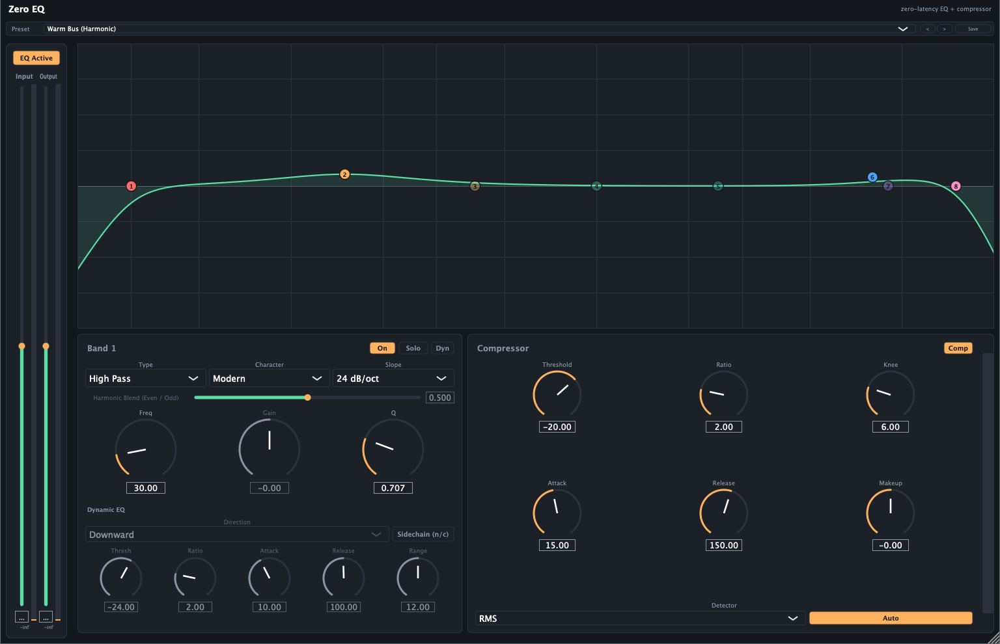

# Zero EQ user guide

Zero EQ is an 8-band parametric equaliser and compressor plugin (VST3 / AU), built around one
promise: **it adds no latency at all**.

> **Before live use:** the DSP has been verified analytically and against real audio, passes
> `pluginval` and Apple's `auval`, and has been hosted in REAPER. It has **not** been used on
> real hardware in a live signal chain. Review it before putting it on a show.

---

## Why "zero latency" matters

Most EQ plugins that offer a linear-phase mode buy it with **lookahead** — the plugin delays
your audio so it can see ahead. That's fine when mixing, but it means you can't sing or play
through it: you'd hear yourself late.

Zero EQ deliberately gives that up. Every filter is minimum-phase, there's no lookahead, no
oversampling and no internal buffering. **You can track through it and monitor through it.**

The trade-off is honest and permanent: there is **no linear-phase mode**, and there never
will be. That's the deal.

---

## Installing

Build it, or take a release build. On macOS the VST3 goes to
`~/Library/Audio/Plug-Ins/VST3/Zero EQ.vst3`; the AU alongside it. Rescan plugins in your DAW.

---

## The EQ

*Everything is on one surface. Band 1 is selected below the curve, with its dynamic-EQ section
underneath it and the compressor alongside — so the EQ move and the gain reduction reacting to it
are visible at the same time.*

### Working with the curve
The main display is a spectrum analyser with your EQ curve over it, and a draggable node per
band.

- **Drag a node** — frequency (left/right) and gain (up/down)
- **Scroll on a node** — Q, i.e. how wide or narrow the band is
- **Double-click** — add a band, or toggle one on and off

### Band types
**Bell** boosts or cuts around a centre frequency. **Low/High Shelf** lift or drop everything
below/above a corner. **High Pass / Low Pass** remove everything below/above a corner
entirely. **Notch** cuts sharply at one frequency (for hum or a ringing resonance).
**Band Pass** keeps only a region. **Tilt Shelf** tilts the whole spectrum about a pivot.

For High Pass and Low Pass you also get a **Slope**: 12, 24, 36 or 48 dB/octave — how steeply
it cuts.

### Character — the interesting control
Each band has a **Character**, and it changes how the band behaves, not just how it sounds:

- **Modern** — the textbook parametric. Q is independent of gain: a narrow band stays narrow
  however much you boost.
- **Vintage** — proportional Q. **The more gain you apply, the wider the band gets**, the way
  passive and console EQs behave. Broad musical moves feel more natural; surgical cuts are
  harder.
- **Harmonic** — Modern's response, **plus** harmonics generated from that band's own
  frequency region and mixed back in. Boosting adds warmth or grit rather than just level.

**Harmonic Blend** (only meaningful on Harmonic) sweeps from **even** harmonics at 0 —
tube-like warmth — to **odd** at 1 — transistor-like grit.

A Harmonic band at 0 dB gain is completely transparent, so the character costs nothing until
you use it.

### Solo
Soloing a band lets you hear only what that band is affecting — invaluable for finding a
resonance. **Soloing one band mutes the others.**

---

## Dynamic EQ

Any band with gain (Bell, shelves, Tilt) can be switched to **dynamic**, meaning it only acts
when the audio in its own region needs it.

- **Downward** — pull back when the region gets loud. A de-esser is the classic case: the
  band dips only when there's actually sibilance, leaving the rest of the vocal alone.
- **Upward** — lift when the region gets quiet.

Controls: **Threshold** (the level it reacts around), **Ratio** (how hard), **Attack** and
**Release** (how fast in and out), **Range** (the most it may move).

### Sidechain
Switch a dynamic band to **Sidechain** and it reacts to an *external* input instead of the
audio passing through — this is how you duck music under a voice at specific frequencies
rather than pulling the whole track down.

If your host isn't feeding the sidechain input, the band quietly falls back to listening to
the internal signal rather than failing.

---

## Compressor

A feed-forward compressor after the EQ.

**Threshold** — where it starts working. **Ratio** — how hard. **Attack / Release** — how
fast. **Knee** — how gradually compression eases in around the threshold; a wide knee is
gentler and less obvious.

**Detector** picks how loudness is measured: **Peak** catches short transients, **RMS**
(the default) follows average loudness and sounds more natural on programme material.

**Auto Makeup is on by default** and estimates how much level to give back. Note that while
it's on, **the manual Makeup control does nothing** — turn Auto off to set makeup yourself.
Auto is deliberately gentle rather than fully restoring peak level.

---

## Metering

Three readings, answering different questions:

- **Peak** — the highest sample. Rises instantly, falls back gradually so you can actually
  read a transient.
- **True Peak** — the highest point of the *reconstructed* waveform, including between
  samples. This is the one that matters for clipping: a signal can read safe on sample peak
  and still clip on conversion or in a lossy encoder.
- **VU** — slow and averaged; tracks perceived loudness.

The **clip indicator** trips slightly below 0 dBFS (-0.1 dB) and holds for about 1.5 seconds
so a brief clip doesn't vanish before you see it.

---

## Presets

Factory presets are on the preset bar; you can save your own. Every factory preset has been
swept to confirm it applies correctly, produces no NaN audio, and reports zero added latency.

---

## Known quirks — not bugs

**Two `pluginval` warnings on the AU build** are expected and benign: *"Disabling non-main
buses failed"* (a documented JUCE/AudioUnit interaction for plugins with a sidechain bus) and
*"Current program is -1"* (the AU wrapper reports no preset selected until a host picks one).
Apple's own `auval` passes clean.

---

## Troubleshooting

**Gain does nothing on a band.** High Pass, Low Pass, Notch and Band Pass have no gain — they
remove or keep a region, they don't level it. Use a Bell or shelf.

**Slope does nothing.** It only applies to High Pass and Low Pass.

**Harmonic Blend does nothing.** The band's Character isn't set to Harmonic, or its gain is at
0 dB (where a Harmonic band is transparent by design).

**Makeup gain does nothing.** Auto Makeup is on. Turn it off.

**A dynamic band isn't reacting to my sidechain.** Check your host is actually feeding the
plugin's sidechain bus — routing it is host-specific. Without it the band falls back to the
internal signal, which looks like "sidechain isn't working".
